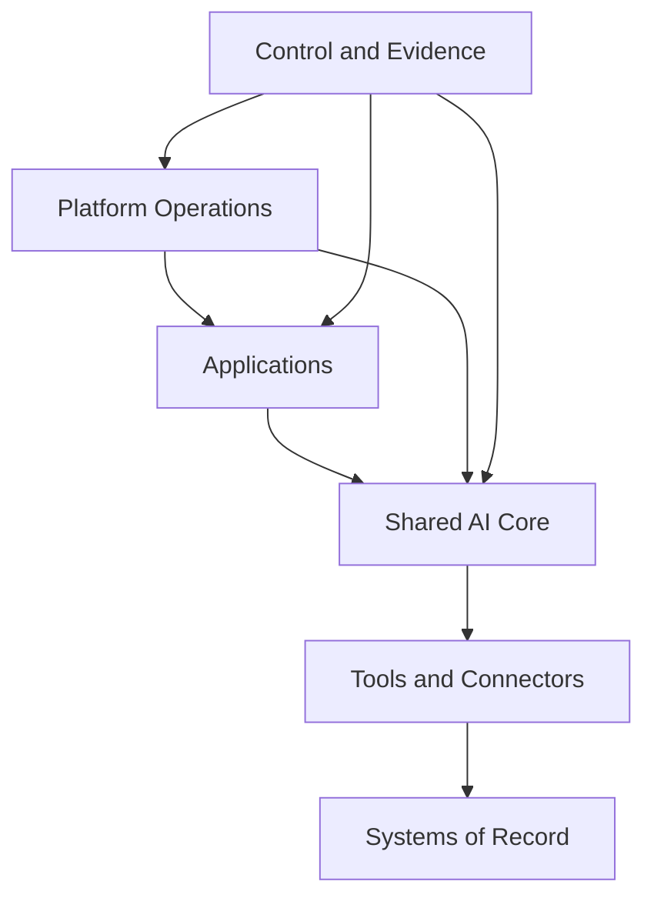

# Proposed System Design

Status: Conceptual target architecture requiring repository and stakeholder validation

## Design objective

Create a governed path from employee-built AI experiments to institutionally owned production applications while centralizing capabilities that should be reused across applications.

## Architectural principles

1. Applications own business workflows; they should not duplicate reusable judgment or system mechanics.
2. Shared capabilities have clear contracts, owners, versions, evaluations, and consumers.
3. Deterministic computation and external-system access live in testable tools and connectors.
4. Production identity, secrets, deployment, and observability are organization-controlled.
5. Automation may propose changes; humans approve consequential architectural, security, and production decisions.
6. Existing applications migrate incrementally. The architecture must support coexistence during transition.

## Logical architecture

### Applications

User-facing or scheduled workflows such as VA School, desk-drive, inbox sweeps, and campaign responders. Applications own workflow-specific behavior and user experience.

### Shared AI core

Reusable capabilities such as voice drafting, safe database writes, scheduling, inbox triage, compliance guardrails, and reusable judgment. The exact distribution model is not yet decided.

### Tools and connectors

Deterministic code or MCP tools for computation and I/O. These isolate API mechanics, permission boundaries, validation, retries, and audit behavior from model instructions.

### Systems of record

Capital Factory business systems including CRM and databases, email and communications, documents, calendar, AngelList, Airtable, and other approved platforms.

### Platform operations

Source control, continuous integration, deployment, secrets, service identities, environment configuration, backups, and recovery.

### Control and evidence

The application catalog, ownership, production-readiness scorecards, health, errors, AI traces, evaluations, cost, security evidence, and architecture decisions.

## Primary flows

### Capability invocation

1. An application requests a versioned capability.
2. The capability receives only the context and permissions required for the task.
3. The capability invokes deterministic tools for external actions.
4. Tools authenticate through scoped machine identities.
5. The execution records health, cost, latency, tool use, and evaluation-relevant outcomes according to data policy.

### Capability change

1. A proposed change identifies affected consumer applications.
2. Unit tests and capability evaluations run.
3. Required owners review the change.
4. A versioned release is produced.
5. Consumers upgrade through a controlled process.
6. Failed evaluations or production regressions can trigger rollback.

### New application intake

1. The business purpose, owner, data, systems, and autonomy level are documented.
2. The capability catalog is checked before new reusable logic is created.
3. Security, IAM, deployment, evaluation, and operational requirements are assigned based on risk.
4. The application advances through experimental, beta, and production gates.

## Trust boundaries requiring validation

- Employee identity versus organization-controlled service identity.
- Application runtime versus shared-core runtime.
- Shared core versus external AI providers.
- Tools and connectors versus systems of record.
- Production data versus development, preview, evaluation, and observability environments.
- Human-approved actions versus autonomous actions.

## Decisions still required

1. Shared-capability distribution: repository content, package, service, MCP, managed plugin marketplace, or hybrid. The Claude Enterprise private plugin marketplace is a candidate because it distributes the format the estate already uses; see technical-stack.md for the Phase 1 spike that tests it.
2. Repository topology: one shared-core repository, monorepo, or coordinated repositories.
3. Claude-specific versus provider-neutral model access.
4. Identity provider and machine-identity strategy.
5. Approved secrets architecture.
6. Hosting model for scheduled and server workloads.
7. Observability content and retention policy.
8. Evaluation platform and release gates.
9. Application catalog implementation.
10. The reference application and first extraction candidate.

## Initial proof-point definition

The first implementation should prove the complete operating model, not merely create another shared library. It should demonstrate:

- Canonical ownership and source.
- Managed deployment.
- Organization-controlled identity and secrets.
- Consumption of at least one shared capability.
- Repeatable tests or evaluations.
- Health, errors, AI usage, and cost visibility.
- Human approval for consequential actions where required.
- Recovery or rollback.

