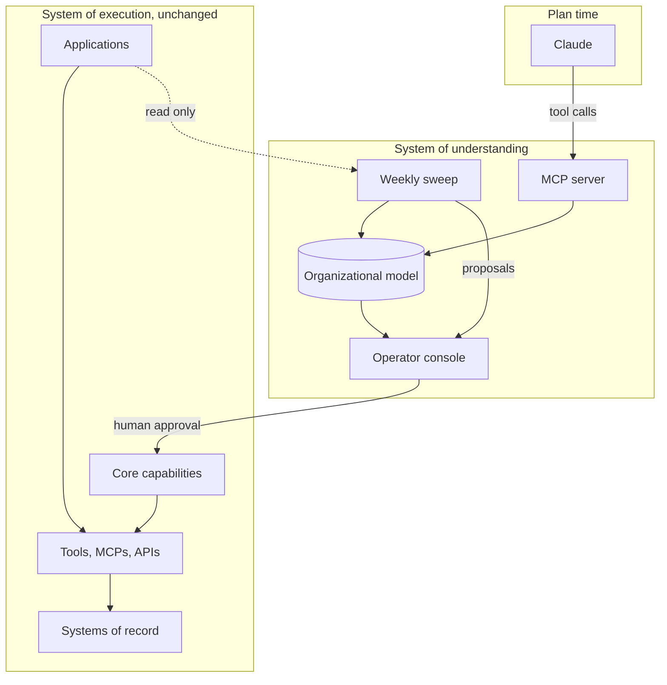

# System Design

Status: Concrete design following the August 26 discovery session and the follow-up note of August 27.
Companion documents: `architecture-decision.md` (why this shape and not the alternatives), `90-day-proposal.md` (build sequence), `prd.md` (specification).

---

## What this is

The follow-up note described four ideas in outline. This document makes them concrete enough to build from.

1. Build an intelligence layer that maps what Capital Factory already has, across repositories, skills, APIs and MCPs, deployments, and data sources, and turns it into a structured understanding of existing capabilities.
2. Make that available to Claude through an MCP and API layer, so that before building something new, Claude can check what already exists, what can be reused, what standards apply, and where the relevant systems live.
3. Create a feedback loop, so that as new applications get built the system learns from them, identifies duplication and improvement, and keeps the shared understanding current.
4. Keep it invisible to employees, who continue working through Claude and the tools they already use.

Everything below is the machinery for those four, plus the parts of the reasoning that determine whether it can actually be built in ninety days.

---

## The two systems

The single most useful distinction in this design.

**The system of execution stays exactly where it is.** GitHub is GitHub. Vercel is Vercel. Applications stay deployed where they are deployed. Nothing migrates, nothing freezes, nobody stops shipping.

**The system of understanding is what gets built.** A layer underneath the tools people already use, answering: what have we built, what can we already do, where does it live, who owns it, what does it touch, what should a new application follow, and are two teams building the same thing right now.

The estate does not have a user interface problem. It has a memory problem. Building another destination would be solving the wrong one.

---

## Design constraints

From the discovery session, in the sponsor's own terms.

**Invisibility.** "I don't want our employees to have to worry about what's in the core." The understanding layer is queried by Claude, not browsed by people. Any feature that requires a builder to know it exists has failed this constraint and should be cut.

**No slowdown.** "It's okay if they keep developing apps; I don't want to slow them down." The design is additive to a team of eight that keeps shipping. No freeze, no migration window, no rewrite.

**Thin and replaceable infrastructure, compounding knowledge.** The organizational context is the asset. Every piece of machinery that reads or serves it should be built to be deleted when something better ships.

**Identity is out of scope.** Systems administration, SSO, and credential management belong to a separate IT and security engagement. This system consumes whatever identity model that work produces and is deliberately designed to depend on as little of it as possible.

---

## The organizational model

Five entity types, matching what the follow-up note listed, plus the two edges that make the model useful.

| Entity | What it records |
| --- | --- |
| **Application** | A job owned end to end. Where it lives, who owns it, what it consumes, whether it is live |
| **Capability** | One reusable competency. What it does, written for a model to read. May live inside an application or in the core |
| **Tool** | How a capability reaches the outside world: MCP server, API, or custom integration |
| **Deployment** | Where an application actually runs, including employee machines |
| **Data source** | A system of record: CRM, investor database, email, documents, calendar, AngelList, Airtable |

Two relationships carry most of the value:

**Consumer edge.** Application X depends on capability Y at version Z. The edge, not the node, is what makes a breaking change detectable and what makes "who does this affect" answerable in a second.

**Similarity edge.** Capability A and capability B appear to do the same thing. Proposed by the sweep, confirmed or rejected by a human, never assumed.

A note on shape. This is a typed model with relationships, which is graph-shaped, but a graph database is an implementation choice and not an architectural commitment. The durable thing is the type system and the content. How it is stored should be the cheapest option that answers the queries below.

### The registry entry

The single most important artifact in the system, because it is what a model reads at plan time.

```
id: safe-crm-write
does: >
  Writes a record to the investor database after applying
  rejection rules for duplicates, malformed entities and
  unapproved fields.
never: >
  Deletes records. Writes without an originating approval
  reference.
inputs: [record, approval_ref]
outputs: [write_result, rejection_reason]
touches: [investor-db]
reached_via: mcp://cf-crm
approval: required for writes affecting more than 10 records
owner: unassigned
consumers: [lp-report-builder, deal-notes-sync, portfolio-refresh]
evaluation: none
status: in_apps
freshness: 2026-08-29T06:00Z
```

The `does` field is an API surface, not documentation. A vague description does not produce a weak search result, it produces a false negative at plan time, and a false negative produces a duplicate that ships. Description quality is therefore a tested property with a defect class of its own.

Entries are stored in a format Anthropic's tooling reads natively, so that if a first-party registry ships, the content ports and only the implementation is discarded.

---

## How the model gets populated

Two options existed. The decision, and its reasoning, is in `architecture-decision.md`.

**Read-through, first.** The layer reads the five repositories directly on a schedule and generates the model from what it finds. Capital Factory's estate is fifty-one Claude Code skills in five repositories, forty of them reported as strongly documented. That is structured, versioned, and readable in one pass.

**Connectors, by exception.** A connector is added when a specific question cannot be answered from the repositories, and the question is named before the connector is built.

The first likely exception is deployment reality. Whether an application is live, and where it runs, is not reliably in source, and two items are reported to run on an employee laptop. That is one connector, justified by one question.

This is a sequencing decision, not a rejection of a broader ingestion architecture. It exists because a multi-connector normalization and enrichment pipeline is the part of this system most likely to be commoditized within two model releases, and because it is the part that would consume the ninety days without producing anything usable in week three.

---

## Components



The dotted line matters. The sweep only reads. Nothing in the understanding layer changes an application without a person approving it.

### 1. The MCP server

The interface, and the reason no new destination gets built. Claude Code already speaks MCP, so a builder opens Claude the way they already do and the tools get called without anyone being asked to call them.

Proposed tool surface:

| Tool | Purpose |
| --- | --- |
| `capability_search(description)` | Semantic match against the model. Returns candidates with confidence and a usage example. The single most important call in the system |
| `capability_get(id)` | Full contract: does, never does, inputs, outputs, systems touched, approval gates, how to invoke |
| `application_list(filter)` | What exists, who owns it, what it consumes |
| `standards_get(context)` | The conventions a new application in this context should follow |
| `systems_describe(name)` | What a system of record holds, how it is reached, what rules apply to writing to it |
| `usage_log(query, matches, outcome)` | Records what was asked, what matched, and what was built |

Two design rules on this surface.

**Metadata only.** The server describes capabilities; it never proxies the data those capabilities touch. It will say the estate can analyse a startup and where that lives. It will not read the investor database. The moment it brokers real data it inherits an access-control problem, and identity belongs to a separate engagement. Keeping it metadata-only is both the right boundary and what makes it shippable.

**Semantic, not nominal.** `capability_search` matches on described behaviour, not names. In an estate organized by person, names are the least reliable signal available.

### 2. Plan-time reuse

The mechanism the sponsor described directly: "the following twenty things, tell me if we already did that before."

1. A builder describes what they want and works through the PRD.
2. The PRD is decomposed into candidate capabilities.
3. Each is searched against the model.
4. Matches come back with confidence and a usage example.
5. Claude wires the application to what exists and builds only what does not.
6. The builder sees a working application and is never shown the registry.

Every query, match, and non-match is logged through `usage_log`. The non-matches are the highest-value output: a capability three separate PRDs asked for and the model could not supply is a capability the estate is about to build three times.

### 3. The feedback loop

Weekly, read-only, across the estate. It is both the extraction mechanism and the drift auditor, and it is one component with two outputs.

1. Inventory what changed since the last run.
2. Detect capabilities implemented more than once, and divergence between copies.
3. Apply the four-criterion extraction test from `architecture-decision.md`.
4. Emit a ranked queue, each item carrying one of three recommendations with its reasoning: extract into the core, patch in place across the copies, or leave alone and keep watching.
5. Regenerate the model.

The three-way recommendation is the point. Semantic similarity alone would tell you to merge `draft-like-jamie` and `draft-like-drew`, which is wrong, because independence is the feature there. Detection is the easy half. The test is the judgment layer.

Proposals are approved by a human for the whole of the first ninety days. Automatic extraction is a decision to make with evidence from the queue, not before the queue exists.

This is the loop the follow-up note described: every new application makes the next one easier to build, because what it taught the model is available the next time someone plans anything.

### 4. The operator console

The only human interface, built for one person, the platform owner. A control room, not a storefront.

It answers: what is the sweep proposing this week and what happened to last week's, what exists and who owns it, where are the coverage gaps, what is the discovery query failing to find, and what does the estate cost to run.

It does not offer a browse-and-install experience. Nobody shops here.

---

## Primary flows

### New application

Builder declares intent. PRD interview produces a structured PRD. Claude searches the model, reuses what exists, and builds the rest. New reusable work is registered on the next sweep. The builder's experience is: wrote a PRD, said go, got an application.

### Weekly sweep

Read the estate. Detect duplication and divergence. Apply the test. Rank and publish. Platform owner approves, defers, or rejects. Approved extractions become work items with a named owner and a required evaluation.

### Capability change, once in the core

The change identifies affected consumers from the model. Tests and the capability evaluation run. Owner and affected consumer owners review. A versioned release is produced. Consumers upgrade through a controlled path. A failed evaluation or a production regression triggers rollback.

---

## What this system does not do

- It does not manage identity, SSO, machine credentials, or systems administration.
- It does not migrate existing applications. Applications change only when an approved extraction touches them.
- It does not build applications. The app layer is the second phase.
- It does not proxy data from systems of record.
- It does not run continuously. Always-on proactive agents are not economically viable on subscription inference at this scale, and weekly is the design point.

---

## Phase two, and why it gets easier

The follow-up note is right that these become much more useful once the understanding layer is reliable, and it is worth saying precisely why.

**PRD generation** is the interview that feeds `capability_search`. Without the model it produces a document; with the model it produces a document that already knows what not to rebuild.

**Application scaffolding** becomes assembly rather than authorship, because `capability_get` returns a contract and an invocation example rather than a pointer to a repository.

**Employee onboarding** stops being a person walking someone through fifty applications. A new employee's Claude gets the Capital Factory MCP and inherits the institutional knowledge on day one. This is configuration, not construction.

**Proactive agents** become affordable, because the expensive part of a proactive agent is working out what is going on, and the model already knows.

---

## Portability to Station

Station Austin, Station Northwest Arkansas, and Station DC use Claude as a chatbot, build no applications, and have no GitHub.

The intent is to port the environment rather than the applications: repository conventions, the model, the MCP layer, the sweep, the standards. The scaffold, not the contents.

The design implication is a hard constraint from week one. Every component must be valid against an empty estate. A model with zero capabilities, a sweep with nothing to find, and a `capability_search` that always returns no match must all be correct states.

This is also the strongest argument for the read-through approach over a connector pipeline. A connector-first design has nothing to connect to at Station. A registry-first design works there on day one, and the value at Station comes from duplication never accumulating in the first place.

A system that only works on an existing mess is a cleanup. A system that works on an organization that has not started yet is an operating model.

---

## Decisions still required

1. Storage for the organizational model, tested against the constraint that content must port if a first-party registry ships.
2. Where the MCP server runs and how it is distributed to eight builders.
3. Whether `capability_search` uses embeddings, a model call, or both, and what confidence threshold suppresses a match.
4. Repository topology for the core: single repository, monorepo, or coordinated repositories.
5. Distribution mechanism for extracted capabilities, including whether the managed plugin marketplace covers it.
6. The minimum evaluation bar a capability must clear to enter the core.
7. Hosting for the weekly sweep.
8. Whether per-function model routing goes through a gateway from the start or waits for the first multi-function capability.
9. Observability content and retention, pending a named data-policy owner.
10. The first three extraction candidates, which is an output of the first sweep rather than a decision made in advance.

---

## The one thing that has to be learned first

Everything above rests on a question that is currently unanswered: how the fifty-one items actually reach the systems they touch. In many cases MCPs, in some cases an API or something custom built, and nobody currently knows the distribution.

If the estate reaches its systems through a handful of shared MCP servers, the understanding layer has a clean seam to sit on and extraction is largely packaging. If it reaches them through thirty-one hand-rolled integrations with embedded credentials, this is a different project. That is why mapping the tool layer is the first milestone rather than an inventory exercise, and why the estimates downstream of it are labelled as estimates.
